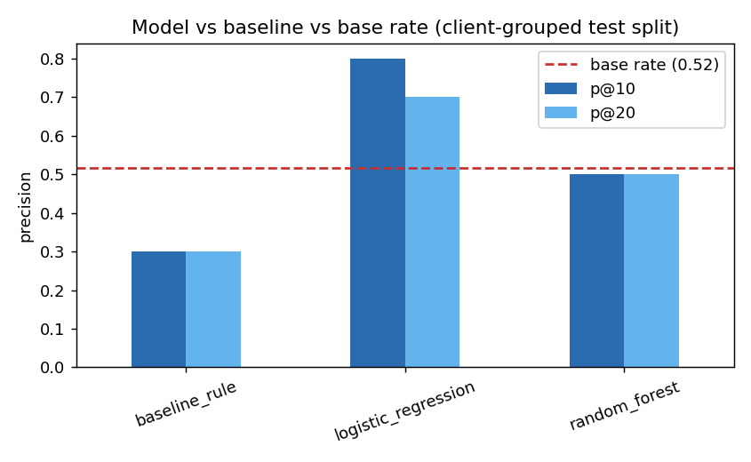
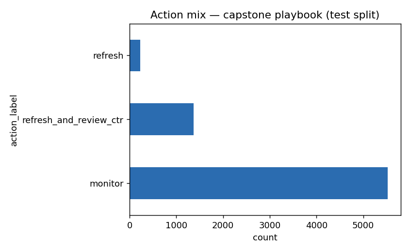

# Capstone Report — Content Refresh Prioritization

- **Author:** Azlan Faisal Raj
- **Lane:** Content Refresh Prioritization
- **Repo:** https://github.com/AzlanFaisalRaj/flyrank-internship-ml
- **Date:** August 2026

## 0. Abstract

Which of a client's content pages should get reviewed for a refresh first? Using 30,000 real
FlyRank content items across 32 clients (90-day search performance windows), a client-grouped
logistic regression was compared against a transparent staleness-and-CTR-gap rule on an
identical holdout split. The model lifts precision@10 from the rule's 0.30 to 0.80, clearing
both the rule and the 0.52 base rate, while a leakage test confirmed the gap is real and not a
label leak. The output is a ranked, reason-coded review queue for a content strategist running
weekly refresh triage — decision-support, not an automated action.

## 1. Problem framing

**The decision.** A content strategist or SEO reviewer needs a shortlist of pages worth
reviewing for a refresh, out of a library too large to check page by page.

**Unit of analysis.** One content item (one page), summarized over a trailing 90-day window.

**Output.** A ranked queue: a priority score, a reason code (why it's flagged), and a suggested
action (`refresh_and_review_ctr`, `refresh`, or `monitor`).

**Who acts, and the cost of a wrong call.** A content strategist reads the queue top-down. A
false positive costs an editor's time on a page that didn't need it. A false negative lets a
real decline go unreviewed until the next cycle. Neither is severe on its own, which is why the
output is framed as a starting shortlist a human still checks, not an automated decision.

**Why ML here.** A single hand-written rule (stale + visible + CTR gap) only reaches 0.30
precision@10 — barely above guessing once you account for base rate. The real pattern is messier
than an if-statement: staleness only matters in a specific window (91–180 days, not "older is
always worse"), and CTR only signals a problem after controlling for position tier and traffic
volume. A model that can weigh many such signals together outperforms the fixed rule.

## 2. Data safety

**Source.** `data/raw/content_refresh_anonymized.csv` — the FlyRank ML Internship starter
release. 30,000 rows, one row per pseudonymous content item, 32 clients, 90-day trailing window
plus a last-30-days vs prior-30-days comparison. The same lane also queried the full production
warehouse directly (`hf://datasets/FlyRank/internship-warehouse`, March 2026 partition) to build
and verify a daily-grain data contract (`work/notebooks/w03_data_contract.ipynb`); the capstone
model itself trains on the 30,000-row aggregated release, which carries the full weekly-notebook
lineage (baseline through validation).

**Excluded, and why:**
- `trend_direction` / `trend_pct` — define the label; never used as features.
- Every `*_last_30d` / `*_prev_30d` column — the label is the swing between these two windows,
  so any of them in the feature set is the label wearing a different name. Confirmed directly:
  adding them back pushes precision@10 to 1.00 and ROC AUC to 0.81.
- `content_id` / `client_id` — hashed grouping keys only, never features, and never mapped back.
- `gsc_avg_position == 0` rows (warehouse work only) — `0` means "no position data," not rank
  zero.

**Public safety.** No client names, domains, URLs, page titles, or raw queries appear anywhere
in this repo. Rate columns (`ctr`, `engagement_rate`) are percentages on a 0–100 scale.

## 3. Baseline

A transparent rule, built from two signal checks against the base rate (54.2% of all 30,000
rows are labeled declining):

- **Staleness (mixed signal):** decline rate is elevated specifically in the `91-180` day
  freshness window (61.1% vs the 54.2% base rate) — but *not* at the extreme tail (`181+` drops
  to 47.1%, below base rate). The rule uses the `91-180` window only, not "older is worse."
- **CTR vs position (confirmed, once volume-floored):** raw medians looked backwards until
  filtering to `impressions_90d >= 300` — after that, CTR drops cleanly as position tier gets
  worse (0.23 → 0.20 → 0.17 → 0.08 → 0.00).

**The rule:** flag a page if it is stale (91–180 days), visible (≥300 impressions/90d), *and*
underperforming its own position tier's expected CTR.

**Baseline result (client-grouped test split, n=7,115):** precision@10 = 0.30, precision@20 =
0.30, ROC AUC = 0.49 — essentially at the base rate (0.52). The rule flags real cases but adds
little discrimination on its own.

## 4. Model / analysis

**Method.** Logistic Regression, compared against a Random Forest — two models, not more, since
complexity has to earn its place on the metric that matters (precision@K for a top-of-queue
reviewer) rather than being added by default.

**Label.** `is_declining_label` = 1 if `trend_direction == "down"` (impressions down >10%,
last 30 days vs prior 30 days), else 0 — an **observed proxy**, not a verified future outcome.

**Features (34 kept, 23 numeric + 11 categorical).** Content metadata (word count, age, type),
90-day observed performance (impressions, clicks, CTR, position tier, engagement), and
freshness/staleness fields — everything knowable without looking at the label's own comparison
window.

## 5. Evaluation

**Split.** Client-grouped (`GroupShuffleSplit`, 75/25, seed 42), not row-by-row. Pages from the
same client share client-level patterns; a random row split would let the model partly memorize
per-client behavior and inflate the score. No usable timestamp column exists in this release for
a time-aware split, so client-grouped is the honest option available. Client overlap between
train and test is confirmed at 0.

**Results (same test split, same metric):**

| Model | precision@10 | precision@20 | ROC AUC |
|---|---|---|---|
| Baseline rule | 0.30 | 0.30 | 0.49 |
| Logistic Regression | **0.80** | **0.70** | 0.575 |
| Random Forest | 0.50 | 0.50 | **0.597** |
| Base rate (floor) | 0.52 | — | — |


*Both models beat the rule baseline on precision@10; logistic regression is the strongest
top-of-queue ranker despite random forest's higher overall AUC.*

**Error analysis.** False positives (predicted decline, actually stable) cluster in
mid-probability pages (0.69–0.85) in `page_3_5` and `page_1` tiers — content that looks stale
and underperforming on paper but didn't actually decline, plausibly because the 91–180 window is
a noisy proxy rather than a guarantee. False negatives sit at lower, less confident probabilities
(0.34–0.44) — the model treats these as uncertain rather than confidently wrong, a healthier
failure mode than confident misses.

**Leakage check.** Adding the excluded `*_last_30d`/`*_prev_30d` columns back into the feature
set pushes precision@10 from 0.80 to 1.00 and ROC AUC from 0.575 to 0.81 — the exact
"score collapses when the leak is removed" signature. This confirms both that those columns
really were leaking and that the evaluation harness is sensitive enough to catch it.

## 6. Interpretation

Permutation importance on the Random Forest ranks `days_with_impressions` and `impressions_90d`
highest, then `avg_position`, `ctr`, and `position_tier` — visibility and traffic-volume signals
dominate, which makes sense: a real decline shows up first on pages people actually see. No
single feature separates the classes cleanly (max correlation with the label ≈0.19), which is a
mild anti-leakage signal on top of the column exclusions above.

**A negative result worth stating plainly:** the Random Forest's higher ROC AUC (0.597 vs 0.575)
does *not* translate into a better top-10 — it only matches the base rate at precision@10/20.
For a reviewer who only ever looks at the top of the queue, the simpler model wins. More model
complexity did not earn its place here.

## 7. Recommendation

The playbook ranks pages by `priority_score = model_probability x impressions_90d`, so a page
only ranks high if the model flags real risk **and** enough people actually see it — a 0.9-
probability page with 5 impressions ranks below a 0.6-probability page with 300,000.


*Of 7,115 test-split pages: 224 get a routine `refresh`, 1,369 get `refresh_and_review_ctr`
(a specific, checkable gap), and 5,522 are `monitor` — not enough evidence to act on yet.*

**How a reviewer uses this tomorrow.** Start at rank 1, work down. For every
`refresh_and_review_ctr` row, open the page and rule out a branded/navigational query, a
mid-run title experiment, or a SERP feature stealing the click before rewriting anything. For any
`ctr == 0.00%` row at real volume, check for a tracking or pipeline gap first, a content problem
second. `monitor` means "not enough evidence right now," never "fine forever" or "deprioritize."

**What should never be automated:** auto-publishing or auto-editing, automatic
deprioritization/removal, cross-client comparison as a performance judgment (the queue is
traffic-weighted, not fairness-weighted, so a client appearing rarely near the top isn't
evidence that client is fine), and retraining or threshold changes without human sign-off.

**Confidence.** This is decision-support, not a verdict. On the model's own precision@10, roughly
2 of every 10 top-10 picks are expected to be wrong even in the best case.

## 8. Reproducibility

**Environment.** Python 3.12, `pandas`, `scikit-learn`, `matplotlib` — see `requirements.txt`.
Random seed fixed at 42 everywhere a split or model is trained.

**To re-run from a fresh clone:**
```bash
pip install -r requirements.txt
jupyter nbconvert --to notebook --execute --inplace work/notebooks/capstone.ipynb
```
This regenerates every number and chart in this report from
`data/raw/content_refresh_anonymized.csv`, and writes `work/outputs/capstone_metrics.json` (the
committed receipts) and the two figures embedded above.

**Full lineage.** The capstone builds directly on:
- `work/notebooks/w03_data_contract.ipynb` (ML-04) — data contract, verified against the live
  warehouse.
- `work/notebooks/w04_baseline_score.ipynb` (ML-07) — the baseline rule and its signal checks.
- `work/notebooks/w05_model.ipynb` (ML-08) — model choice, split design, error analysis.
- `work/notebooks/w06_validation_audit.ipynb` (ML-09) — honest-split audit and the leakage
  confirmation.
- `work/notebooks/w07_action_playbook.ipynb` (ML-10) — the ranked-queue design and no-go list.
- `work/notebooks/capstone.ipynb` (ML-11) — this report's exact source, runnable end to end.

## 9. Acknowledgments & data credit

Built on the [FlyRank ML Internship dataset](https://flyrank.ai).
